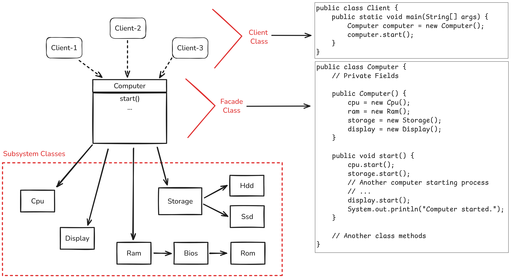

## Facade Pattern:
Tek seferde birden fazla method calling yapan bir interface tanımlayarak, client ile karmaşık subsystem'ler arasındaki 
bağımlılığın kaldırılmasını sağlayan pattern'dır.

Bu pattern'nın amacı, client'in karmaşık subsystemlerin nasıl çalıştığını bilmek zorunda kalmadan system'i 
kullanabilmesini sağlamaktır. Böylece client'lar system'den yararlanabilmek için system'in iç yapısını bilmek zorunda kalmazlar.

Facade pattern daha teknik olarak, fine-grained interface'lerden oluşmuş bir sistemi, tek seferde birden çok iş yapan 
method'lardan oluşan tek bir coarse-grained interface'e dönüştürür. 
[Akın Kaldiroglu Design Pattern Yapisal Kaliplar PDF, Sayfa 108 ](https://github.com/javaturk/DesignPatterns/blob/master/Slides/5%20-%20Yap%C4%B1sal%20Kal%C4%B1plar.pdf)

### Örnek Yapı:

Buradaki örnekte Computer class'ı coarse-grained interface olarak yer alır. Interface olarak kastedilen şey aslında bir 
class'tır. Buradak interface terimi ile akla ilk gelen interface imgesi farklı şeylerdir.

### Kurumsal Uygulamalardaki Kullanımı:
Bu pattern genellikle web service'lerdeki katmanlı mimarilerde controller-service-repository'de sık sık karşılaşılır.
Controller'lar client tarafından call edildiğinde, karmaşık bir sistemin giriş kapısı gibi davranırlar. Client, controller
katmanının sadece ne yaptığını bilir, nasıl yaptığını bilmez.